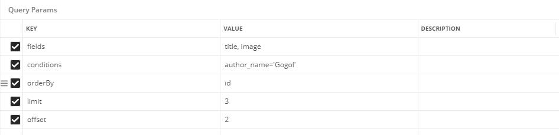

##Тестовое задание для Node.js.


#### 1. Задача.

Реализовать http-server на базе фреймворка Koa2, соответствующий следующим требованиям:

1. Работает с базой данных mysql. В субд есть таблица books(1e5 записей, заполнена случайными данными). У каждой книги должны быть поля _title, date, author, description, image_. Реализация смежных таблиц на усмотрение кандидата, архитектурные решения оцениваются.​ **Работает на "чистом" SQL**
2. Присутствуют три контроллера:

   1. Добавляет записи в субд
   2. Отдает. Сделать возможность сортировки|группировки по всем возможным полям, возможность порционного получения с оффсетом **\***
   3. Изменяет

**\*** - приветствуются варианты кэшировани


#### 2. Разбор задачи.

**База данных.**
Бд была приведена к третьей нормальной форме. Структура БД приведена ниже на схеме:

```
table: authors
    id     <---------┐  primary key
    author_name      |  unique
                     |
table: books_data    |
    author_id  ------┘  compound primary key
    book_id    ------┐
                     |
table: books         |
    id       <-------┘  primary key
    title               
    date
    description
    image           
```
Для предотвращения возможных дубликатов связки автор-книга используем _compound primary key_ `(author_id, book_id)`

**Взаимодействие через роуты.**
Взаимодействие с БД происходит следующим образом:

1.<b>Получение списка книг с таблицы</b>
Осуществляется ```get``` запрос
```http://localhost:3000/find_books``` 
С возможностью указать параметры, такие как:

    1. Необходимые для выборки поля (по умолчанию "*")
    2. Условия выборки
    3. Группировка
    4. Сортировка
    5. Лимит (по умолчанию 100)
    6. Офсет

<b>Пример отправки параметров</b>



2.<b>Получение списка авторов с таблицы</b>
Осуществляется ```get``` запрос
```http://localhost:3000/find_authors``` 
Отправка происходит с аналогичными параметрами

3.<b>Получение данных книга-автор из таблиц</b>
Осуществляется ```get``` запрос
```http://localhost:3000/find_books_data``` 
Отправка происходит с аналогичными параметрами

4.<b>Добавление данных в БД</b>
Осуществляется ```post``` запрос
```http://localhost:3000/add_data```

Пример данных для отправки:
```JSON
{
	"authors":{
		"author_name": "Gogol"
	},
	"books":{
		"title": "Death Souls3",
		"description": "Awesome book"
	}
}
```

5.<b>Изменение данных в БД</b>
Осуществляется ```put``` запрос
```http://localhost:3000/update_data```

С возможностью указать параметры, такие как:

    1. Необходимые для изменения поля
    2. Условия выборки
    
<b>Пример отправки параметров</b>


**ВАЖНО**
Следует отметить, что дубликаты в поле с авторами запрещены, тогда как в поле с книгами приветствуются. То есть может быть несколько  книг с одинаковым названием, но всего лишь один автор с определенным именем.